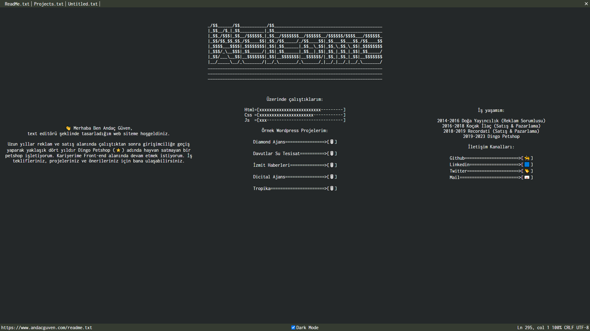
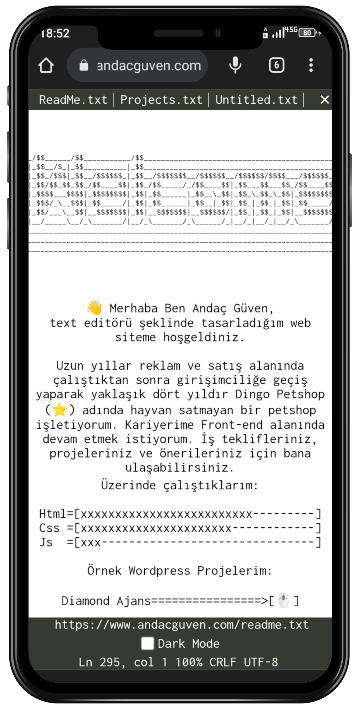
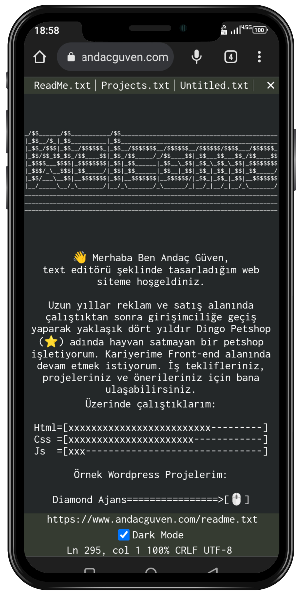

# Text Based Web Site 

## <mark style="background-color: lightgreen">Text Based Retro Design</mark> 

This site development made with HTML&CSS only

<mark style="background-color: Orange">Desktop :</mark>

## <mark style="background-color: lightblue">Modern, Lightweight and minimal</mark>

This design has dark & light mode.

Differen Modes in Mobile:

 

An easy solution is given in the link below.

[How to Make Dark Mode Only Css](https://www.andacguven.com/)

This site already taken by me if you want see way of work.

[Live Website](https://www.andacguven.com/)
